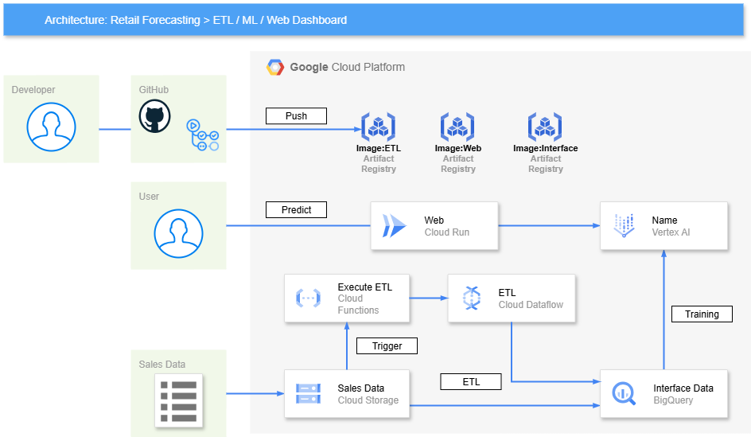
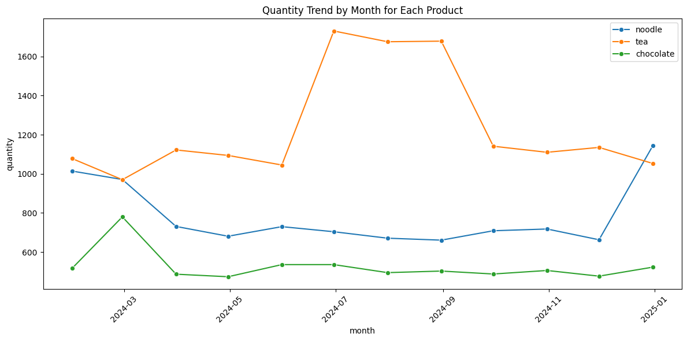

## Dashboard Image Samples

### Dashboard UI Example (Date selection with calendar)

### Inference Result Example (Prediction shown)

> These images show the actual Streamlit dashboard: you can select the date with a calendar and see the prediction results in real time. Great for portfolio demonstration!

# Production-ready ML pipeline with fully automated training & deployment

---

## What is this project?

Fully automated, production-grade ML pipeline on GCP:

- Infrastructure as Code with Terraform
- CI/CD with GitHub Actions
- Vertex AI Custom Training for sales forecasting
- Cloud Run for API deployment

> Reproducible, scalable, and business-oriented ML pipeline for real-world use.

---

## Architecture

GCP (Google Cloud Platform) × Vertex AI × Cloud Run × BigQuery × Terraform × GitHub Actions

---

## Model Evaluation and Realistic Validation

To ensure the reliability of the sales forecasting model, both random split and time-series-aware validation were performed:

- **Random split (with future data leakage):**
  - R² = 0.72, RMSE = 6.86
  - Shows high accuracy, but may overestimate real-world performance due to data leakage.
- **TimeSeriesSplit (no future data leakage, realistic scenario):**
  - Average R² = 0.44, Average RMSE = 9.25
  - Provides a more honest and practical estimate of model performance for real business use.

This project emphasizes realistic validation and honest reporting of model accuracy, reflecting best practices for production ML systems.

Below is an example of the sales trend used in this project:

---

## Features

- All infrastructure managed by Terraform (IaC)
- GitHub Actions triggers training, model registration, and deployment
- Vertex AI custom training with hyperparameter management
- Cloud Run API for real-time predictions

---

## Architecture

---

- **Operational Insights**
  - Cloud Logging and basic monitoring for ETL and model operations.
  - Scheduled queries or Cloud Scheduler automate the data pipeline.

## Infrastructure as Code (IaC)

All Google Cloud resources (GCS, BigQuery, Cloud Functions, VertexAI, etc.) are provisioned and managed using Terraform. This ensures reproducibility, scalability, and easy collaboration for infrastructure management. The Terraform code is organized in the `terraform/` directory, following best practices for modularity and environment separation.

**Key Points:**

- Automated provisioning of all GCP resources
- Version-controlled infrastructure for easy rollback and auditing
- Modular structure for reusability and clarity

## CI/CD Pipeline

GitHub Actions is used to automate the build, test, and deployment process for application code and container images. This includes:

- Linting and testing on every pull request
- Building and pushing Docker images to Artifact Registry
- Deploying to Cloud Functions upon merge to main branch (if applicable)
- (Optional) Infrastructure changes via Terraform plan/apply workflows

The CI/CD configuration is located in the `.github/workflows/` directory.

## Technical Stack

- Storage & Database: Google Cloud Storage, BigQuery
- ETL & Transformation: Cloud Functions, Dataform
- Machine Learning: VertexAI
- Web Interface: Streamlit
- Infrastructure as Code: Terraform
- CI/CD: GitHub Actions

## Purpose

This project demonstrates my ability to design and implement a robust, end-to-end data pipeline and ML solution using Google Cloud. It serves as a portfolio piece to showcase my skills for international freelance projects and overseas job opportunities in data engineering and machine learning. The design choices reflect real-world requirements and best practices expected in global teams.

## Key Points

- Minimal ETL keeps the system simple but functional.
- VertexAI is the core component, providing predictive insights via the web interface.
- Sample sales data includes realistic patterns: weekly seasonality, monthly trends, product categories, and promotions.
- Repository includes architecture diagrams, code, sample data, and screenshots/videos for a complete portfolio demonstration.
