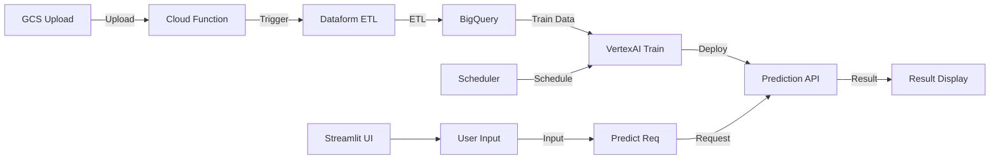

# Enterprise-Level Sales Prediction Dashboard Using VertexAI

## Architecture

Below are two representations of the system architecture:

- **Mermaid Diagram:** Text-based, editable architecture diagram for quick reference and version control.
- **PNG Diagram:** Visually detailed architecture diagram exported from draw.io for presentations and documentation.

## Overview

This project is a full-stack sales forecasting platform for enterprise applications. It predicts future sales based on daily collected data and visualizes the results through an interactive web interface. Minimal ETL processes maintain a clean and reliable data pipeline.

## Design Rationale

This architecture was chosen to demonstrate practical, production-ready skills for international data engineering and machine learning projects. The design emphasizes:

- **Simplicity and Maintainability:** By keeping ETL minimal and leveraging managed services (Cloud Functions, Dataform), the pipeline remains easy to operate and scale, reducing operational overhead.
- **Cloud-Native Best Practices:** All components are serverless or managed, following modern cloud-native patterns that are highly valued in global projects.
- **Reproducibility and Transparency:** The entire workflow, from data ingestion to model serving, is automated and version-controlled, making it easy for others to understand, reproduce, and audit.
- **Realistic Business Scenarios:** The data and features (seasonality, promotions, etc.) are designed to reflect real-world sales forecasting challenges, showing practical problem-solving ability.
- **End-to-End Ownership:** The project covers the full lifecycle (data, ML, UI), proving the ability to deliver complete solutions independently—a key requirement for international freelance and remote work.

## Problem Solved

Many enterprises struggle to bridge the gap between raw data and actionable business insights. This project solves that by providing:

- An automated, reliable pipeline from data collection to prediction delivery
- A user-friendly interface for business users to access forecasts and monitor data/model freshness
- A scalable, cloud-native foundation that can be adapted to various industries and data volumes

## Features

- **Data Management**

  - Store daily sales data in Google Cloud Storage.
  - Use Cloud Functions for light preprocessing (missing value imputation, format conversion, simple aggregations).
  - BigQuery stores raw and processed data; Dataform manages transformations and dependencies for VertexAI-ready datasets.

- **Model Training & Prediction**

  - VertexAI trains models on processed BigQuery data.
  - Models are periodically retrained for accuracy.
  - Predictions are available online through an interactive web interface.

- **Web Interface**

  - Built with Streamlit for easy deployment.
  - Users select date ranges, store IDs, and product categories to generate predictions.
  - Results displayed in tables and charts for comparison with historical data.
  - Model update dates and data refresh dates are displayed for a “internal tool” feel.

- **Operational Insights**
  - Cloud Logging and basic monitoring for ETL and model operations.
  - Scheduled queries or Cloud Scheduler automate the data pipeline.

## Infrastructure as Code (IaC)

All Google Cloud resources (GCS, BigQuery, Cloud Functions, VertexAI, etc.) are provisioned and managed using Terraform. This ensures reproducibility, scalability, and easy collaboration for infrastructure management. The Terraform code is organized in the `terraform/` directory, following best practices for modularity and environment separation.

**Key Points:**

- Automated provisioning of all GCP resources
- Version-controlled infrastructure for easy rollback and auditing
- Modular structure for reusability and clarity

## CI/CD Pipeline

GitHub Actions is used to automate the build, test, and deployment process for application code and container images. This includes:

- Linting and testing on every pull request
- Building and pushing Docker images to Artifact Registry
- Deploying to Cloud Functions upon merge to main branch (if applicable)
- (Optional) Infrastructure changes via Terraform plan/apply workflows

The CI/CD configuration is located in the `.github/workflows/` directory.

## Technical Stack

- Storage & Database: Google Cloud Storage, BigQuery
- ETL & Transformation: Cloud Functions, Dataform
- Machine Learning: VertexAI
- Web Interface: Streamlit
- Infrastructure as Code: Terraform
- CI/CD: GitHub Actions

## Purpose

This project demonstrates my ability to design and implement a robust, end-to-end data pipeline and ML solution using Google Cloud. It serves as a portfolio piece to showcase my skills for international freelance projects and overseas job opportunities in data engineering and machine learning. The design choices reflect real-world requirements and best practices expected in global teams.

## Key Points

- Minimal ETL keeps the system simple but functional.
- VertexAI is the core component, providing predictive insights via the web interface.
- Sample sales data includes realistic patterns: weekly seasonality, monthly trends, product categories, and promotions.
- Repository includes architecture diagrams, code, sample data, and screenshots/videos for a complete portfolio demonstration.
