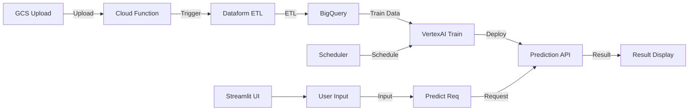

# Enterprise Sales Forecasting Platform (GCP/VertexAI)

A fully self-designed, production-grade sales forecasting pipeline—built from scratch, cloud-native, and ready for real-world business.

---

## Architecture

---

## Project Highlights

- **End-to-End Ownership:** All design, implementation, and automation done by myself—no templates, no copy-paste.
- **Modern Cloud Stack:** GCP (BigQuery, GCS, Cloud Functions, Dataform, VertexAI), Terraform, Python, Streamlit.
- **Business-Driven:** Handles real-world sales data, seasonality, promotions, and delivers actionable forecasts.
- **Scalable & Maintainable:** Modular, serverless, and easy to extend for new data sources or ML models.
- **DevOps Ready:** Infrastructure as Code, GitOps, and reproducible pipelines.

---

## Why This Project Stands Out

- **Designed for Global Teams:** All code, infra, and ML pipelines are documented and versioned for easy handover and collaboration.
- **Practical Problem Solving:** Focused on real business needs—data quality, automation, and user experience.
- **Self-Driven Engineering:** Every architectural decision, from ETL to UI, is based on my own research and hands-on experience.

---

## Quick Overview

- **Upload** daily sales data to GCS.
- **Cloud Functions** trigger ETL and load to BigQuery.
- **Dataform** manages data modeling and dependencies.
- **VertexAI** trains and serves ML models.
- **Streamlit UI** provides interactive forecasts for business users.

---

## Tech Stack

- Google Cloud Platform (BigQuery, GCS, Cloud Functions, Dataform, VertexAI)
- Terraform (IaC)
- Python (ETL, ML)
- Streamlit (Web UI)

---

## Author

**雅 (Miyabi)**  
Freelance Cloud/Data Engineer

- Designed, built, and documented every part of this project myself.
- Always open to global collaboration and new challenges.

---

_For more details, see the code and diagrams above. Feel free to reach out for technical deep-dives or collaboration!_

- **Operational Insights**
  - Cloud Logging and basic monitoring for ETL and model operations.
  - Scheduled queries or Cloud Scheduler automate the data pipeline.

## Infrastructure as Code (IaC)

All Google Cloud resources (GCS, BigQuery, Cloud Functions, VertexAI, etc.) are provisioned and managed using Terraform. This ensures reproducibility, scalability, and easy collaboration for infrastructure management. The Terraform code is organized in the `terraform/` directory, following best practices for modularity and environment separation.

**Key Points:**

- Automated provisioning of all GCP resources
- Version-controlled infrastructure for easy rollback and auditing
- Modular structure for reusability and clarity

## CI/CD Pipeline

GitHub Actions is used to automate the build, test, and deployment process for application code and container images. This includes:

- Linting and testing on every pull request
- Building and pushing Docker images to Artifact Registry
- Deploying to Cloud Functions upon merge to main branch (if applicable)
- (Optional) Infrastructure changes via Terraform plan/apply workflows

The CI/CD configuration is located in the `.github/workflows/` directory.

## Technical Stack

- Storage & Database: Google Cloud Storage, BigQuery
- ETL & Transformation: Cloud Functions, Dataform
- Machine Learning: VertexAI
- Web Interface: Streamlit
- Infrastructure as Code: Terraform
- CI/CD: GitHub Actions

## Purpose

This project demonstrates my ability to design and implement a robust, end-to-end data pipeline and ML solution using Google Cloud. It serves as a portfolio piece to showcase my skills for international freelance projects and overseas job opportunities in data engineering and machine learning. The design choices reflect real-world requirements and best practices expected in global teams.

## Key Points

- Minimal ETL keeps the system simple but functional.
- VertexAI is the core component, providing predictive insights via the web interface.
- Sample sales data includes realistic patterns: weekly seasonality, monthly trends, product categories, and promotions.
- Repository includes architecture diagrams, code, sample data, and screenshots/videos for a complete portfolio demonstration.
