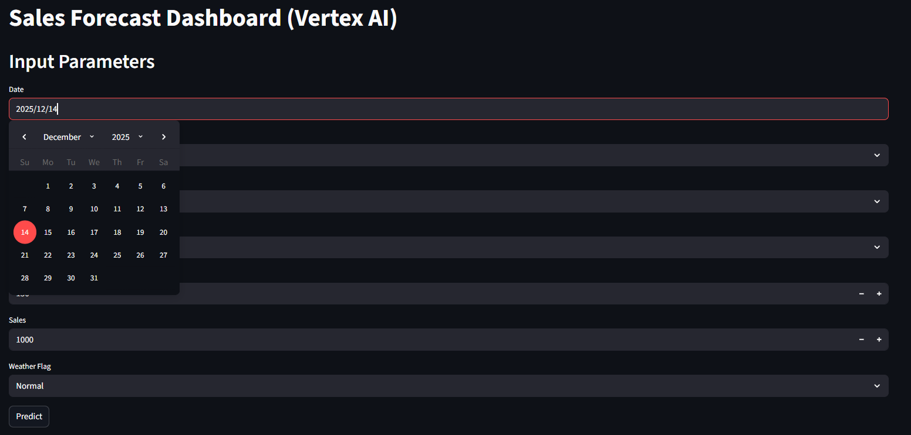
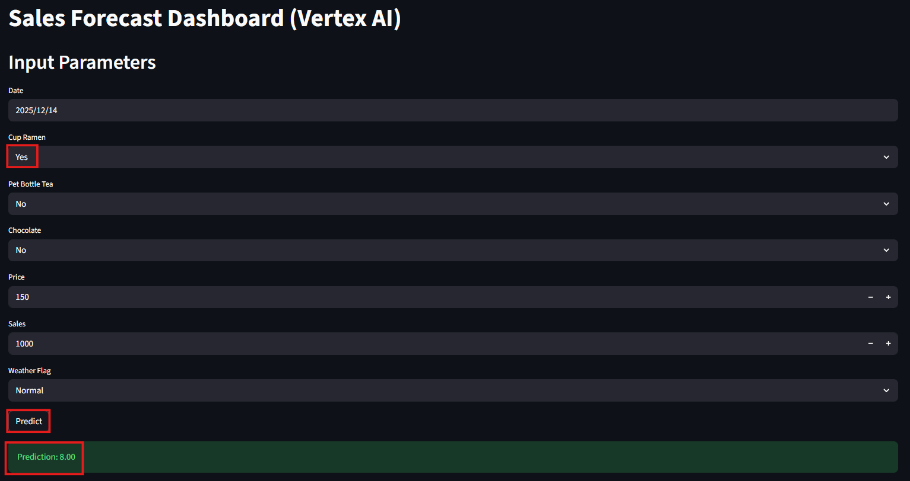

# Enterprise Sales Forecasting Dashboard

Businesses rely on sales forecasts for budgeting, inventory planning, and strategic decision-making.  
However, many forecasting systems fail in production due to unrealistic evaluation methods and a lack of deployment readiness.

This project addresses those challenges by providing a **production-ready sales forecasting system**
with realistic time-series validation and a fully automated ML pipeline on Google Cloud Platform.

---

## Dashboard Preview

### Dashboard UI (Date Selection with Calendar)

### Inference Result (Prediction Output)

> The Streamlit dashboard allows users to select a date and receive real-time sales predictions.  
> Predictions are served through a scalable Cloud Run inference API.

---

## Business Value

- Enables more reliable revenue forecasting for planning and budgeting
- Reduces the risk of overconfident predictions caused by future data leakage
- Provides a scalable architecture that integrates easily into real business workflows

---

## System Architecture

**GCP × Vertex AI × Cloud Run × BigQuery × Terraform × GitHub Actions**

### High-level Flow

1. Sales data is stored and queried in BigQuery  
2. Model training runs on Vertex AI using custom training jobs  
3. Trained models are versioned and managed centrally  
4. Predictions are served via a Cloud Run inference API  
5. The Streamlit dashboard consumes the API for real-time forecasting  
6. Infrastructure and deployments are automated via Terraform and CI/CD

---

## Model Evaluation (Realistic Validation)

To ensure reliable forecasting performance, two validation strategies were compared:

### Random Split (with future data leakage)
- R²: **0.72**
- RMSE: **6.86**

> Shows high apparent accuracy, but is unsuitable for real-world forecasting.

### TimeSeriesSplit (no future data leakage)
- Average R²: **0.44**
- Average RMSE: **9.25**

> Provides a more honest and production-relevant estimate of model performance.

This project intentionally prioritizes **realistic evaluation over optimistic metrics**, reflecting best practices for enterprise-grade ML systems.

Below is an example of the sales trend used in this project:

---

## Key Features & Technical Stack

### Key Features
- End-to-end automated ML pipeline from data ingestion to prediction
- Real-time sales forecasting via Cloud Run API
- Interactive dashboard for business users
- Time-series–aware validation strategy
- Fully reproducible and auditable infrastructure

### Technical Stack
- **Cloud Platform:** Google Cloud Platform (GCP)
- **Data & Storage:** BigQuery, Cloud Storage
- **Machine Learning:** Vertex AI (custom training)
- **Serving:** Cloud Run
- **Web Interface:** Streamlit
- **Infrastructure as Code:** Terraform
- **CI/CD:** GitHub Actions

---

## Infrastructure as Code (IaC)

All cloud resources are provisioned and managed using **Terraform**, enabling:

- Reproducible environments
- Version-controlled infrastructure
- Scalable and maintainable system design

Terraform configurations are organized in the `terraform/` directory, following modular best practices.

---

## CI/CD Pipeline

GitHub Actions automates the full lifecycle of the system:

- Linting and testing on pull requests  
- Docker image build and push to Artifact Registry  
- Model training and registration on Vertex AI  
- Automated deployment of services and infrastructure

Workflow definitions are located in the `.github/workflows/` directory.

---

## Purpose

This project serves as a portfolio piece demonstrating my ability to design and implement
**production-grade machine learning systems** using Google Cloud.

It highlights skills relevant to:

- Enterprise data engineering  
- Machine learning system design  
- Cloud-native architecture  
- International freelance and overseas engineering roles  

All design decisions reflect real-world constraints and best practices expected in global engineering teams.

---

## Key Takeaways

- Emphasis on realistic ML evaluation over inflated metrics  
- Clear separation between training and inference components  
- Automation-first approach using IaC and CI/CD  
- Business-oriented design rather than experiment-driven ML
